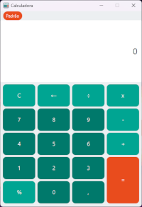

# Calculadora

Este repositório contém o código-fonte de uma calculadora desenvolvida em **Java**, utilizando **JavaFX** com suporte ao **Scene Builder**. O projeto segue o modelo **Maven** para organização e gerenciamento de dependências.

## Funcionalidades

- Operações básicas: soma, subtração, multiplicação, divisão e porcentagem.
- Operaões Científicas: Exponenciação, radiciação e valor absoluto.
- Interface gráfica intuitiva e responsiva.

## Tecnologias utilizadas

- **Java**
- **JavaFX**
- **Scene Builder**
- **Maven**

## Estrutura do Projeto

O projeto é estruturado da seguinte forma:

```
Calculadora/
├── src/
│   ├── main/
│   │   ├── java/
│   │   │   └── com/github/gustaa13
│   │   │       ├── aplication
│   │   │       │   ├── CalculadoraApp.java
│   │   │       │   └── Main.java
│   │   │       ├── controller
│   │   │       │   ├── ControladorInterfaceCientifico.java
│   │   │       │   └── ControladorInterfacePadrao.java
│   │   │       ├── model
│   │   │       │   ├── calculators
│   │   │       │   │   ├── CalculadorDeExpressaoCientifico.java
│   │   │       │   │   ├── CalculadorDeExpressaoPadrao.java
│   │   │       │   │   └── VetorizacaoDeExpressao.java
│   │   │       │   ├── Calculadora.java
│   │   │       │   └── Util
│   │   │       │       ├── exceptions
│   │   │       │       │   ├── DivisaoPorZeroException.java
│   │   │       │       │   └── PosicaoNaoExisteException.java
│   │   │       │       ├── inputHandlers
│   │   │       │       │   ├── TratadorDeEntradasCientifico.java
│   │   │       │       │   └── TratadorDeEntradasPadrao.java
│   │   │       │       ├── AlertaGeral.java
│   │   │       │       ├── ControladorDeTeclas.java
│   │   │       │       └── FormatadorDeExpressao.java
│   │   └── resources/
│   │       └── com/github/gustaa13
│   │           ├── calculadora-cientifica.fxml
│   │           ├── calculadora-padrao.fxml
│   │           └── estilo.css
│   │       └── image
│   │           ├── calculadora.png
│   │           ├── tela-cientifica.fxml
│   │           └── tela-padrao.css
├── .gitignore
├── pom.xml
└── README.md
```

- `CalculadoraApp.java`: Classe principal que inicializa a aplicação.
- `Main.java`: Classe de suporte para configuração inicial.
- `ControladorInterfaceCientifico.java` e `ControladorInterfacePadrao.java`: Controladores para as interfaces gráficas científica e padrão.
- `CalculadorDeExpressaoCientifico.java` e `CalculadorDeExpressaoPadrao.java`: Lógicas para manipulações e chamadas de cálculos científico e padrão.
- `VetorizacaoDeExpressao.java`: Tratamento de vetorização para manipulação pelas classes anteriores.
- `DivisaoPorZeroException.java` e `PosicaoNaoExisteException.java`: Classes de exceções personalizadas.
- `TratadorDeEntradasCientifico.java` e `TratadorDeEntradasPadrao.java`: Manipuladores e tratadores de entradas para os modos científico e padrão.
- `AlertaGeral.java`: Gerenciamento de alertas e mensagens para o usuário (desuso).
- `FormatadorDeExpressao.java`: Formatação das expressões para saída de usuário.
- `calculadora-cientifica.fxml` e `calculadora-padrao.fxml`: Arquivos FXML para interfaces gráficas.
- `estilo.css`: Estilos visuais da aplicação.

## Requisitos

- **JDK 17** ou superior.
- **Apache Maven**
- **JavaFX SDK** (se não for integrado no JDK utilizado).

## Como executar

1. Clone este repositório:
   ```bash
   git clone https://github.com/Gustaa13/Calculadora.git
   ```

2. Navegue até o diretório do projeto:
   ```bash
   cd Calculadora
   ```

3. Compile e execute o projeto com o Maven:
   ```bash
   mvn javafx:run
   ```

## ícone

 

Pixel art por Diego Nascimento.

## Telas

  

---

Desenvolvido por [Gustaa13](https://github.com/Gustaa13).
